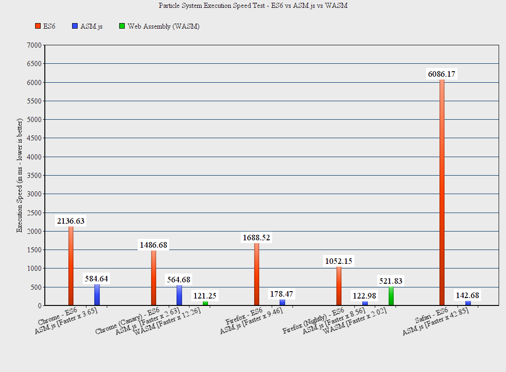

# Particle System

## Description

A Particle System experiment designed to benchmark web technologies from a non trivial piece of code: ES6, Emscripten and Web Assembly

## Setup/Usage Instructions

- Building the ASM.js and WebAssembly versions:

 If you want to build the Web Assembly version, you need to build the Emscripten toolchain **from source** using the **incoming branch**. The master branch does NOT support BINARYEN=1 option at the moment

     [Install Emscripten Portable SDK](https://kripken.github.io/emscripten-site/docs/getting_started/downloads.html#all-os-installation-instructions-portable-sdk)
     
     [Building Emscripten from Source](https://kripken.github.io/emscripten-site/docs/building_from_source/index.html?highlight=build%20from%20source)
     
      . cd particle-system/Emscriptem
      . make
      . emcc -s NO_EXIT_RUNTIME=1 -s release/ParticleSystem.bc --post-js ParticleSystem/glue.js -o dist/asmjs/ParticleSystem.asm.js
      (or run emcc-asmjs.sh script for mac/linux users. Assumes emcc is in your PATH)
      . eemcc -s NO_EXIT_RUNTIME=1 -s BINARYEN=1 release/ParticleSystem.bc --post-js ParticleSystem/glue.js -o dist/wasm/ParticleSystem.js
      (or run emcc-wasm.sh script for mac/linux users. Assumes emcc is in your PATH)
        

- Building the the ES6 Particle System Library and the Test pages:

        . npm install
        . npm run build-lib-dev / npm run build-lib-prod
        (prod version is minified and without source map)
        . npm run build-tests

- Running the tests:
  
  Serve Test/. with the HTTP server of your choice ...
 
 If you want to test Web Assembly versions, you need a browser that supports Web Assembly.
 
 At the moment [Chrome Canary](https://www.google.com/chrome/browser/canary.html), [Firefox Nighly](https://nightly.mozilla.org/) and soon in Microsoft Edge.

## Slides

[Boost your Web Application with C++](http://leefsmp.github.io/Particle-System/slides/index.html)

## Live Tests

Performance Tests:

 * [ES6 vs ASM](http://leefsmp.github.io/Particle-System/Test/Test%20-%20vs/ES6-vs-ASM.html)

 * [ES6 vs WASM](http://leefsmp.github.io/Particle-System/Test/Test%20-%20vs/ES6-vs-WASM.html)

Autodesk Forge Viewer Test:

 * [ES6](http://leefsmp.github.io/Particle-System/Test/Test%20-%20viewer/es6.html)

 * [asm.js](http://leefsmp.github.io/Particle-System/Test/Test%20-%20viewer/asm.html)

 * [wasm](http://leefsmp.github.io/Particle-System/Test/Test%20-%20viewer/wasm.html)

Three.js Tests:

 * [ES6](http://leefsmp.github.io/Particle-System/Test/Test%20-%20three.js/es6.html)

 * [asm.js](http://leefsmp.github.io/Particle-System/Test/Test%20-%20three.js/asm.html)

 * [wasm](http://leefsmp.github.io/Particle-System/Test/Test%20-%20three.js/wasm.html)

I've been testing against the following browsers: Chrome, Chrome Canary, Firefox, Firefox Nightly and Safari.
Only Canary and Firefox Nightly supports WASM, so the following benchmark only indicate those.
Running WASM in a browser that doesn't support it is using a fallback which ends up being very very slow ...

## License

This sample is licensed under the terms of the [MIT License](http://opensource.org/licenses/MIT). Please see the [LICENSE](LICENSE) file for full details.

##Written by 

Written by [Philippe Leefsma](https://twitter.com/F3lipek)

